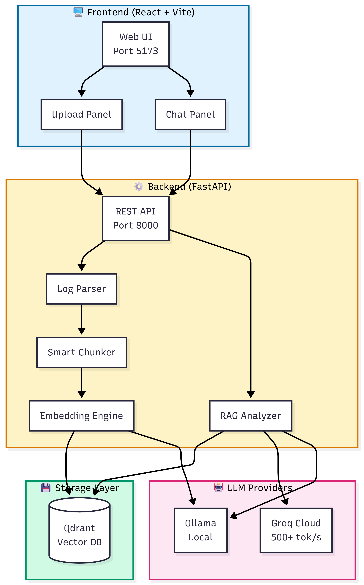
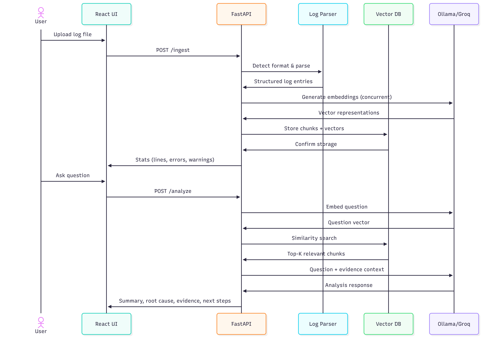
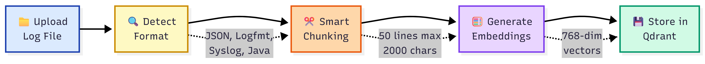
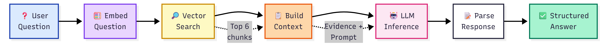
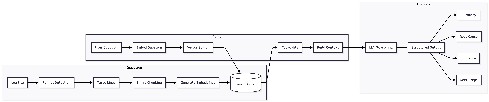

---
layout: default
title: Designing an LLM-Powered Incident Copilot for Production Log Analysis
---

# Designing an LLM-Powered Incident Copilot for Production Log Analysis

*How I built an AI system that actually cites its sources  and why that matters more than you'd think.*

---

## The 3 AM Problem

It's 3 AM. Your phone buzzes. Production is down.

You SSH into the server, tail the logs, and stare at 50,000 lines of text scrolling past. Somewhere in there is the answer. But where?

You try `grep ERROR`. 2,000 results. You try `grep -B5 -A5 "connection refused"`. Still too much noise. You start mentally correlating timestamps, service names, and stack traces  all while Slack is blowing up with "any update?"

**This is the reality of incident debugging in 2026.** Despite advances in observability tooling, much of incident response still relies on:

- Manual log inspection
- Pattern recognition built over years
- Tribal knowledge that lives in senior engineers' heads
- Caffeine and adrenaline

I've been there. Many times. And I kept asking myself: *Can AI actually help here  not with a chatbot demo, but with real production logs?*

So I built **LLM Incident Copilot** to find out.

---

## What I Actually Built

LLM Incident Copilot is a local, reproducible system that:

| Capability | Description |
|------------|-------------|
| **Ingests real logs** | Multi-MB production-style log files (not toy examples) |
| **Semantic retrieval** | Finds relevant log chunks using vector embeddings |
| **Evidence-backed analysis** | Every AI conclusion cites specific log lines |
| **Structured output** | Summary, root cause, confidence, evidence, next steps |

Here's what the output looks like:

```json
{
  "summary": "Database connection pool exhausted between 14:30-14:45",
  "probable_root_cause": "Connection leak in DatabasePool.getConnection()",
  "confidence": "high",
  "evidence": [
    {
      "chunk_id": "a1b2c3d4",
      "quote": "ERROR [pool-1] - Connection pool exhausted, waiting..."
    }
  ],
  "next_steps": [
    "Check connection release in finally blocks",
    "Add pool exhaustion alerts",
    "Review recent database-related commits"
  ]
}
```

**The goal isn't to replace engineers.** It's to reduce the time spent on initial triage by surfacing relevant evidence quickly and consistently.

---

##  See It In Action

### Uploading and Analyzing Logs


*Drag and drop any log file. The system auto-detects the format (JSON, Logfmt, Syslog, Java/Hadoop) and extracts metadata.*

### AI-Powered Root Cause Analysis


*Ask questions in plain English. Get structured answers with evidence citations from actual log lines.*

---

## The Architecture: RAG With Guardrails

At a high level, the system follows a **Retrieval-Augmented Generation (RAG)** pattern  but with strict guardrails for correctness.

### System Architecture



*The complete system architecture showing Frontend, Backend, Storage, and LLM layers.*

### How It Works



*End-to-end flow from log upload to AI-powered analysis.*

### The Key Components

| Component | Technology | Why I Chose It |
|-----------|------------|----------------|
| **Frontend** | React 18 + Vite | Fast dev experience, hot reload |
| **Backend** | FastAPI (Python 3.11) | Async support, Pydantic validation |
| **Vector DB** | Qdrant | Simple API, cosine similarity, self-hosted |
| **Embeddings** | nomic-embed-text (768-dim) | Good quality, runs locally via Ollama |
| **LLM** | Groq or Ollama | Flexibility: cloud speed vs. local privacy |

### The Pipeline: Two Distinct Flows

**1. Ingestion Pipeline**  When you upload a log file:



*Upload  Format Detection  Smart Chunking  Embeddings  Vector Storage*

**2. Analysis Pipeline**  When you ask a question:



*Question  Embed  Vector Search  Build Context  LLM Inference  Structured Answer*

### Data Flow



*Complete data flow through the system.*

> **Critical design decision:** The LLM never sees the full log  only retrieved evidence. This is deliberate. It limits hallucination and enforces grounding.

---

## The Core Engineering Challenges

Building this wasn't straightforward. Here are the three hardest problems I solved.

### Challenge 1: Log Chunking Is Harder Than It Looks

My first attempt was naive: split logs every 50 lines. It failed badly.

**What went wrong:**

| Problem | Impact |
|---------|--------|
| Errors lost temporal context | Couldn't correlate cause and effect |
| Warnings and errors got separated | Missed the "warning  error" pattern |
| Important causal lines fell into different chunks | Retrieval became noisy |
| Fixed-size chunks ignored log structure | Java stack traces got split mid-trace |

**My solution: Semantic-density chunking**

Instead of chunking by size alone, I prioritize chunks that contain:
- Errors and warnings
- Repeated failure patterns
- Temporal clusters of issues

```python
# Prioritize error-heavy chunks when file is too large
if len(chunks) > MAX_CHUNKS:
    indexed = list(enumerate(zip(chunks, metas)))
    indexed.sort(key=lambda x: (
        x[1][1].get("error_count", 0) * 10 +  # Errors weighted 10x
        x[1][1].get("warn_count", 0)
    ), reverse=True)

    selected = indexed[:MAX_CHUNKS]
    selected.sort(key=lambda x: x[0])  # Restore temporal order
```

**The result:** Dramatically improved retrieval quality. The LLM now sees the most relevant evidence, not random slices.

---

### Challenge 2: Evidence-First RAG (Anti-Hallucination by Design)

Here's an uncomfortable truth about LLMs in production contexts:

> **Hallucinated confidence is worse than no answer.**

If an LLM confidently tells you "the database is fine" when it's actually on fire, you've wasted precious incident time. I've seen this happen with generic chatbots.

**My approach: Force the model to show its work**

Every response must include:
- Specific `chunk_id` references
- Quoted log lines as evidence
- Explicit confidence level (low/medium/high)

The system prompt is strict:

```python
system = """You are an expert SRE analyzing production logs.

RULES:
1. Only make claims supported by the log evidence provided
2. Cite specific chunk_ids when referencing evidence
3. If evidence is insufficient, say so honestly
4. Focus on actionable debugging steps
5. Be concise but thorough

If you cannot find supporting evidence, lower your confidence
and explicitly state what's missing."""
```

**The result:** The system behaves more like a junior on-call engineer than a chatbot. It shows its reasoning, admits uncertainty, and can be audited.

---

### Challenge 3: Performance Tradeoffs  Local vs. Cloud LLMs

I intentionally designed the system to support multiple inference backends. Why? Because the "best" choice depends on your constraints.

**Observed performance (10MB Zookeeper log, 74K lines):**

| Stage | Time |
|-------|------|
| Log ingestion + embeddings | ~34 seconds |
| Analysis (Groq cloud) | ~2.5 seconds |
| Analysis (Ollama local) | ~30 seconds |

**The tradeoffs are real:**

| Factor | Groq (Cloud) | Ollama (Local) |
|--------|--------------|----------------|
| **Latency** |  2.5s |  30s |
| **Privacy** |  Data leaves your network |  Fully local |
| **Cost** | Free tier available | Free forever |
| **Offline** |  Requires internet |  Works anywhere |

**My takeaway:** The surrounding pipeline (chunking + retrieval) matters more than the model choice. A well-designed RAG system with a smaller model beats a giant model with bad retrieval.

> Designing AI systems is often about orchestrating constraints, not chasing the biggest model.

---

## Real-World Testing (Not Synthetic Demos)

To avoid building something that only works on toy examples, I tested with:

- **LogHub datasets** (HDFS, Zookeeper, Hadoop)
- **Multi-MB real-world log files** (10MB+, 74K+ lines)
- **Production-style failure patterns:**
  - Connection pool exhaustion
  - Timeout cascades
  - Repeated handler failures
  - Burst errors after long idle periods

This exposed edge cases that synthetic data would never reveal:

| Edge Case | What Broke | How I Fixed It |
|-----------|------------|----------------|
| Skewed error distribution | 99% of chunks had no errors | Error-weighted chunk selection |
| Long idle periods | Timestamps jumped hours | Time-gap aware chunking |
| Burst failures | Hundreds of identical errors | Deduplication in retrieval |
| Misleading warning density | Warnings drowned out errors | 10x weight for errors vs warnings |

---

## What Went Wrong (And What I Fixed)

Let me be honest about the failures. These aren't theoretical  they showed up immediately with real logs.

###  Problem 1: Chunk Explosion

**Symptom:** Early versions produced 500+ chunks for a 10MB file.

**Impact:** Ingestion took 3+ minutes. Retrieval was noisy. The LLM got confused.

**Fix:** Hard limit of 50 chunks, prioritized by error density.

###  Problem 2: Embedding Bottleneck

**Symptom:** Sequential embedding calls created thousands of TIME_WAIT connections.

**Impact:** System hung on large files. Network stack got overwhelmed.

**Fix:** Concurrent embedding with ThreadPoolExecutor (5 parallel workers).

```python
executor = ThreadPoolExecutor(max_workers=5)

def ollama_embed(texts: List[str]) -> List[List[float]]:
    vectors = list(executor.map(_embed_single, texts))
    return vectors
```

**Result:** 3x faster ingestion (100s  34s for 10MB file).

###  Problem 3: Over-Confident Answers

**Symptom:** The LLM would say "the root cause is X" even with weak evidence.

**Impact:** Misleading during actual debugging.

**Fix:** Stricter system prompts + explicit confidence reporting + evidence requirements.

###  Problem 4: Local Inference Speed

**Symptom:** 30+ second response times with Ollama.

**Impact:** Felt unusable for interactive debugging.

**Fix:** Added Groq cloud integration (500+ tokens/sec) as an option. Clear UI signaling during loading.

---

## The Tech Stack (For the Curious)

| Layer | Technology | Version |
|-------|------------|---------|
| **Frontend** | React + Vite | 18.3.1 / 6.0.5 |
| **Backend** | FastAPI + Uvicorn | 0.115.6 / 0.32.1 |
| **Vector DB** | Qdrant | Latest |
| **Embeddings** | nomic-embed-text | 768 dimensions |
| **LLM (Local)** | Ollama + llama3.2:3b | - |
| **LLM (Cloud)** | Groq + llama-3.1-8b | - |
| **Container** | Docker Compose | - |

**Why these choices?**

- **FastAPI:** Async support was essential for handling concurrent embedding calls
- **Qdrant:** Self-hosted, simple API, no vendor lock-in
- **Ollama:** Privacy-first option, runs on my laptop
- **Groq:** When I need speed, their free tier is incredibly fast

---

## Who This Is For

This project is aimed at:

 **SREs and on-call engineers**  Faster initial triage during incidents

 **Platform and infrastructure teams**  Exploring AI-assisted debugging

 **Engineers building observability tooling**  RAG patterns for operational data

 **Applied AI engineers**  Building RAG systems for real users, not demos

**It is NOT:**

 A chatbot demo

 A replacement for proper observability

 Magic that "just works" without engineering effort

---

## What's Next

The current system works, but there's more to explore:

| Improvement | Why It Matters |
|-------------|----------------|
| **Strict JSON schema enforcement** | More reliable LLM output parsing |
| **Hybrid retrieval (BM25 + vectors)** | Better keyword + semantic matching |
| **Metrics ingestion** | Correlate logs with CPU/memory/latency |
| **Evaluation harness** | Measure retrieval quality systematically |
| **Fine-grained metadata** | Extract service names, request IDs, trace IDs |

---

## Try It Yourself

**GitHub Repository:** [github.com/Avinash-Amudala/llm-incident-copilot](https://github.com/Avinash-Amudala/llm-incident-copilot)

```bash
# Clone and run
git clone https://github.com/Avinash-Amudala/llm-incident-copilot.git
cd llm-incident-copilot
cp .env.example .env
# Add your GROQ_API_KEY to .env (optional, for faster inference)
docker compose up --build
```

Then open [http://localhost:5173](http://localhost:5173) and upload a log file.

**Feedback welcome**  especially from engineers working in infrastructure, SRE, or applied AI.

---

## Final Thoughts

This project reinforced something I strongly believe:

> **Building useful AI systems is less about models, and more about engineering discipline, evidence, and tradeoffs.**

The LLM is just one component. The real work is in:

- Chunking logs intelligently
- Retrieving the right evidence
- Forcing the model to ground its answers
- Handling edge cases gracefully
- Making performance tradeoffs explicit

If the system can't explain *why* it reached a conclusion, it shouldn't be trusted  especially in production.

---

*Thanks for reading. If you found this useful, consider starring the repo or sharing with your team.*

**Connect with me:**
- GitHub: [@Avinash-Amudala](https://github.com/Avinash-Amudala)
- LinkedIn: [Avinash Amudala](https://linkedin.com/in/avinash-amudala)

---

*Tags: #AI #LLM #RAG #DevOps #SRE #Observability #Python #FastAPI #VectorDatabase #IncidentManagement*
